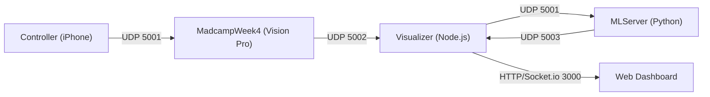

# MADAMP Week 4 - Project Status Report

**Date**: 2026-02-04
**Scope**: Controller, MadcampWeek4, Visualizer, MLServer

## 1. Architecture Overview

The system consists of four main components communicating primarily via UDP over a local network, with a Python-based ML server for real-time inference.

- **Controller (IMUSender)**: Streams IMU/Device motion data. Handshake on port 5000, data to port 5001.
- **MadcampWeek4 (visionOS App)**: Fuses hand tracking with iPhone IMU. Streams unified state (Head, Hands, Controller) to Visualizer on port 5002 via Bonjour discovery.
- **Visualizer (Node.js Hub)**: Discovers Vision Pro, routes data to ML Server (port 5001) and Frontend (Socket.io). Receives ML results on port 5003.
- **MLServer (Python/AvatarJLM)**: Processes raw tracking data via `AvatarJLM` model. Handles resampling and world-space calibration.

---

## 2. Component Analysis

### A. Controller (iOS App)
**Path**: `Controller/IMUSender`
**Status**: [Verified]
- **Handshake**: Responds to Vision Pro discovery on port 5000.
- **Streaming**: Sends 38-byte packets (Timestamp, Pos, Rot) to VP port 5001.
- **Calibration**: Sends `0xD1` to trigger VP calibration, receives `0xD2` on success.

### B. MadcampWeek4 (VisionOS App)
**Path**: `MadcampWeek4/MadcampWeek4`
**Status**: [Verified]
- **Systems**: 
    - `ControllerTrackingSystem`: Handles iPhone connection and computes "Sword Pose".
    - `StreamingSystem`: 60Hz loop broadcasting binary data to Visualizer.
    - `CalibrationManager`: 3s dwell-and-hold logic for World-Space alignment.
- **Protocol**: Uses custom binary headers (`0x50` for data, `0x4C` for logs).

### C. Visualizer (Node.js Hub)
**Path**: `Visualizer`
**Status**: [Verified]
- **Discovery**: Uses `dns-sd` to find `_madcamp-stream._udp` services.
- **Routing**: Efficiently moves data between VP, ML, and Dashboard with a 200ms safety lock for ML processing.
- **UI**: Serves a web dashboard on port 3000.

### D. MLServer (Python Inference)
**Path**: `MLServer`
**Status**: [Verified]
- **Core**: `udp_server.py` handles high-frequency UDP data. `app.py` provides an alternative Flask interface.
- **Inference**: Integrates `AvatarJLM` with a causal resampler (60Hz target).
- **Bug Fix Status**:
    - [x] JS-style `===` in `udp_server.py`: **Resolved** (now uses `==`).
    - [x] Logic gap in `predict()` in `app.py`: **Resolved** (proper initialization of `result`).

---

## 3. Current Project State & Issues

### Functional Coverage
- [x] Vision Pro -> Visualizer Streaming (UDP 5002)
- [x] iPhone -> Vision Pro Fusion (UDP 5001)
- [x] Visualizer -> MLServer Forwarding (UDP 5001)
- [x] MLServer -> Visualizer Result Path (UDP 5003)
- [x] Bonjour Discovery for VP

### Observations & Recommendations
> [!NOTE]
> The system is currently in a "Ready for Integration" state. All major communication paths are established and verified at the code level.

### Next Steps
1. **End-to-End Latency Test**: Measure the full loop delay from iPhone motion to ML result visualization.
2. **AvatarJLM Weight Verification**: Ensure `avatar_jlm.pth` is correctly loaded in the production environment.
3. **Stability check**: Long-running test (>15 mins) to ensure no socket leaks or memory buildup in the Visualizer/MLServer.
