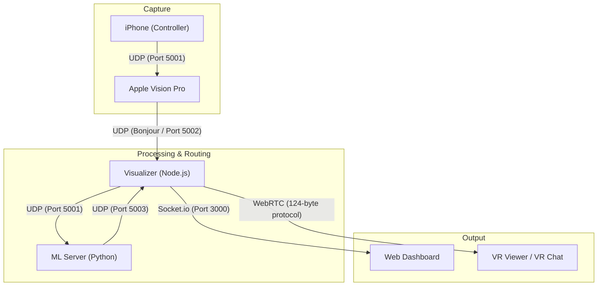

# MADAMP Week 4 - Vision Tracker & Avatar System

This project is a real-time full-body tracking and avatar control system that fuses **Apple Vision Pro** hand/head tracking with an **iPhone-based IMU controller** (lightsaber). The data is processed via a **Node.js Hub** and a **Python ML Server** for real-time motion inference and visualization.

## 🏗 Project Architecture

The system consists of four primary components communicating via UDP and WebRTC.



---

## 📂 Component Overview

### 1. [MadcampWeek4](file:///Users/bagjimin/Documents/1.%20Projects/madcamp/week4/MadcampWeek4) (visionOS App)
The "Heart" of the system.
- **Data Fusion**: Combines local ARKit tracking (Head, Hands) with external iPhone pose data.
- **Systems**:
    - `ControllerTrackingSystem`: Manages iPhone discovery and "Sword Pose" computation.
    - `StreamingSystem`: 60Hz UDP broadcast engine using binary serialization.
    - `CalibrationManager`: Handles World-Space alignment through a dwell-and-hold mechanism.
- **Protocol**: Custom binary format starting with `0x50` (Data) or `0x4C` (Logs).

### 2. [Controller](file:///Users/bagjimin/Documents/1.%20Projects/madcamp/week4/Controller) / [IMUSender](file:///Users/bagjimin/Documents/1.%20Projects/madcamp/week4/IMUSender) (iOS App)
A high-frequency IMU streamer for the iPhone.
- **Motion Capture**: Uses ARKit's `ARWorldTrackingConfiguration` for stable 6DOF pose.
- **Handshake**: Automatically discovers Vision Pro on the local network via UDP Port 5000.
- **Controls**: Includes UI for triggering Calibration (`0xD1`) and Sword Grab/Drop signals.

### 3. [Visualizer](file:///Users/bagjimin/Documents/1.%20Projects/madcamp/week4/Visualizer) (Node.js Hub)
The central router and dashboard.
- **Discovery**: Uses Bonjour (`dns-sd`) to find the Vision Pro.
- **Routing**: Hubs data between Vision Pro, ML Server, and Web Dashboard.
- **WebRTC**: Implements a specialized **124-byte Skeleton Protocol** for low-latency transmission to VR viewers.

### 4. [MLServer](file:///Users/bagjimin/Documents/1.%20Projects/madcamp/week4/MLServer) & [AvatarJLM](file:///Users/bagjimin/Documents/1.%20Projects/madcamp/week4/AvatarJLM) (Python)
The intelligence layer.
- **Model**: Uses `AvatarJLM` (Joint Latent Model) for pose refinement and prediction.
- **Processing**: High-frequency UDP server handling 60fps inference.

---

## 📡 Protocol Specifications

### WebRTC Skeleton Protocol (124 Bytes)
Used for streaming to external viewers. Optimized for minimum bandwidth.
- **Header (4B)**: Sequence Number + Stale Flag.
- **Payload (120B)**: Position and Forward vectors for Head, Left/Right Palms, Elbows, and Sword.
- **Coordinate System**: Right-Handed (Meters).

---

## 🚀 Getting Started

### 1. Visualizer (Mac)
```bash
cd Visualizer
npm install
node server.js
```
Open `http://localhost:3000` for the dashboard.

### 2. ML Server (Python)
```bash
cd MLServer
python udp_server.py
```

### 3. Controller (iPhone)
1. Open `Controller/IMUSender.xcworkspace` in Xcode.
2. Build and run on your iPhone.
3. Ensure iPhone and Mac are on the same Wi-Fi.

### 4. MadcampWeek4 (Vision Pro)
1. Open `MadcampWeek4/MadcampWeek4.xcodeproj` in Xcode.
2. Build and run on Vision Pro.
3. Once running, it will automatically find the Visualizer and start streaming.

---

## 🛠 Project Status
- [x] Vision Pro -> Visualizer UDP Streaming
- [x] iPhone -> Vision Pro Motion Fusion
- [x] Visualizer -> ML Server Forwarding
- [x] WebRTC 124-byte Protocol Implementation
- [x] Bonjour Auto-Discovery

> [!TIP]
> **Calibration is key**: Always use the iPhone's "Calibrate" button while holding the iPhone and Vision Pro in a neutral T-Pose for best tracking results.
