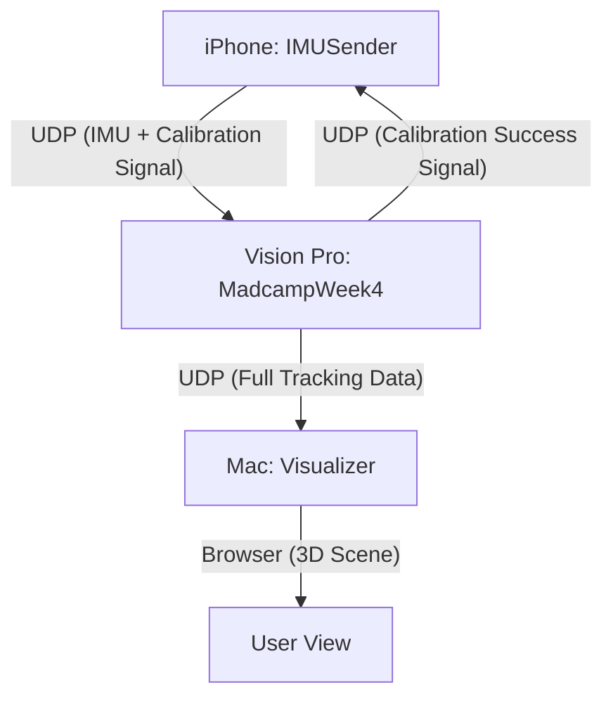

# Madcamp Week 4 Project: 6DOF Controller Tracking System

## 🎯 프로젝트 소개 및 목표
Apple Vision Pro의 핸드 트래킹 기술과 iPhone의 IMU(가속도/자이로) 센서를 결합하여, 하드웨어 컨트롤러 없이도 정밀한 **6DOF(6개 자유도) 가상 컨트롤러 시스템**을 구축하는 것이 목표입니다.

- **목표 1**: Vision Pro 단독으로는 부족한 컨트롤러의 가속도 및 햅틱 피드백을 iPhone으로 보완.
- **목표 2**: 이미지 트래킹을 통한 자동 캘리브레이션으로 Vision Pro 월드 좌표계 내에서 iPhone의 정확한 위치/방향 동기화.
- **목표 3**: 초저지연 UDP 통신을 통한 실시간 데이터 스트리밍 및 시나리오 검증.

---

## 🏗️ 시스템 아키텍처

---

## ✅ 현재 구현 현황

### 1. iPhone App (IMUSender)
- **센서 스트리밍**: 60Hz 이상의 주기로 가속도, 자이로, 쿼터니언 데이터를 전송.
- **자동 페어링**: Bonjour 서비스를 통해 Vision Pro와 페어링 코드 방식으로 자동 연결.
- **캘리브레이션 모드**: 비대칭 요소가 포함된 고대비 마커를 화면에 출력.
- **통신**: UDP 기반의 자체 프로토콜 (IMU 데이터, 캘리브레이션 동기화 신호 D1/D2).

### 2. Vision Pro App (MadcampWeek4)
- **핸드 트래킹**: 양손의 관절 데이터(25개)를 실시간 추출.
- **이미지 트래킹**: ARKit `ImageTrackingProvider`를 사용하여 iPhone 화면의 마커를 3D 공간 상에서 정밀 탐지.
- **컨트롤러 트래킹 시스템**: 
    - **World Offset 계산**: iPhone의 로컬 6DOF 좌표를 Vision Pro 월드 좌표로 변환.
    - **Stability Guard**: 보정 중 손떨림이나 급격한 이동 감지 시 자동 리셋.
    - **Thread-Safe Streaming**: UI 상태(보정 중 여부 등)를 안전하게 백그라운드로 전송.
- **스트리밍 서비스**: 60Hz로 스로틀링된 최적화된 데이터 패킷(14-byte 헤더) 송출.

### 3. Mac Visualizer (Visualizer)
- **백엔드**: Node.js UDP 서버를 통한 데이터 수신 및 WebSockets 중계.
- **프론트엔드**: Three.js 기반의 3D 공간 시각화 (손 골격 + iPhone 컨트롤러 모델).
- **진단 도구**: 지연 시간(Latency) 및 패킷 손실 로그 실시간 확인.

---

## 🚀 최근 주요 성과
- **Natural Static Calibration 시스템 구축**:
    - QR/이미지 마커 없이 손동작(Sweet Spot)만으로 직관적인 보정 수행.
    - **6DOF World Alignment**: iPhone 세션과 Vision Pro 세션 간의 4x4 매트릭스 정밀 정렬.
    - **Jitter Cancellation**: 3초간의 데이터 버퍼링 및 평균화로 손떨림 보정.
- **Decoupled Tracking**:
    - 보정 후 iPhone이 독자적인 6DOF 컨트롤러로 동작 (손 위치에 종속되지 않음).
    - Vision Pro/Mac 양쪽에서 'Preview(파란 박스) -> Unified(칼)' 시각화 흐름 통일.
- **안정성 강화**:
    - HandTrackingProvider/WorldTrackingProvider 스톨 현상에 대한 재시도 로직 추가.
    - UDP 통신 패킷 최적화 (60Hz 스로틀링, 체크섬 검증).

---

## 🛠️ 해결 과제 및 향후 계획
- **정밀도 고도화**: 움직임이 빠를 때의 드리프트 보정 (Kalman Filter 튜닝).
- **인터랙션 피드백**: 가상 물체 충돌 시 iPhone 햅틱 피드백 연동.
- **최종 시연용 시나리오**: 실제 검 베기 동작 등을 포함한 데모 씬 구성.

---
*마지막 업데이트: 2026-02-02 (Natural Calibration & 6DOF Tracking Complete)*
